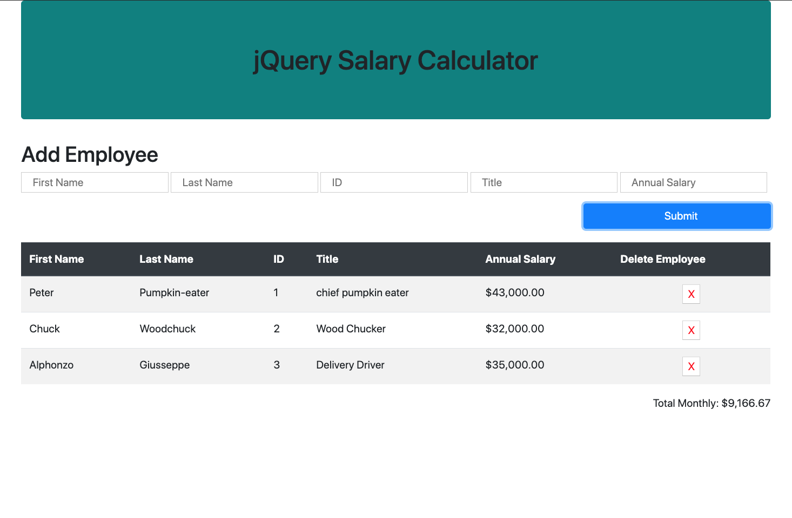

# jQuery Salary Calculator
This is a monthly salary cost calculator. Input employees information and their salaries and this app will tell you how much your monthly salary costs will be.

## Built With
This project uses Html/css with bootstrap for styling and jquery for all calculations and DOM manipulation.

## Getting started

To get this project running:
* fork and clone this repo.
* open index.html in your browser...everything runs client side.

## Prerequisits
In order to run this project you need only download and open index.html.

## Installing

Simply download this repo and run index.html.

Screen shot

## Completed Features
* DOM that displays all employees entered in a table and lists their monthly salary cost.
* Javascript file that calculates monthly salary cost of all employees and manipulates DOM.

## Author
[Stefen Menzel](https://github.com/stefenmenzel)